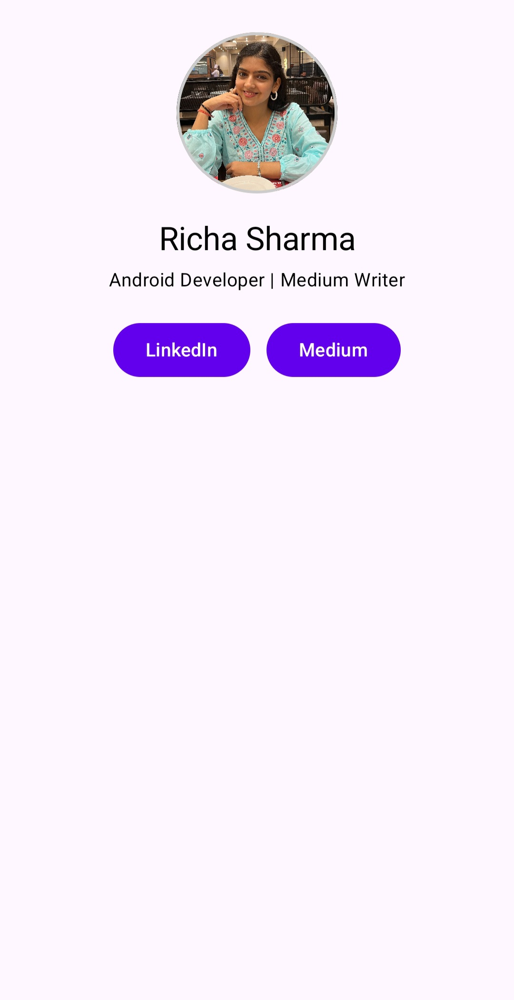
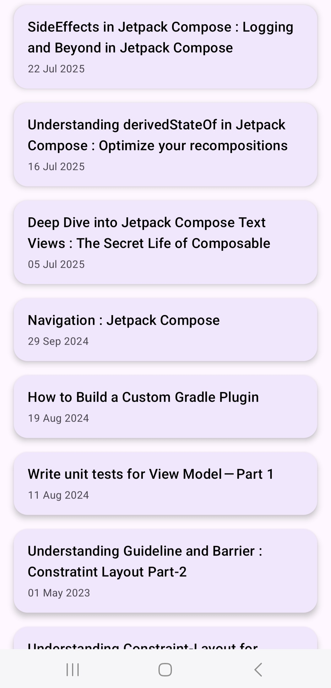

# 📱 Portfolio App - Jetpack Compose + MVVM + Clean Architecture

A personal **Portfolio Android App** built using **Jetpack Compose**, **MVVM**, **Clean Architecture**, and **Hilt**. This app displays your profile and dynamically fetches your latest **Medium Blogs** using an RSS feed parser.

---

## ✨ Features

* Home screen with profile, bio, and social links (LinkedIn, Medium)
* Blog screen to list your latest Medium blog posts
* Clean Architecture with proper layer separation
* Hilt Dependency Injection
* Network call using Retrofit + Simple XML for RSS parsing
* Opens blog links in Chrome Custom Tabs
* UI State management using sealed classes
* Modular, testable code with separation of concerns

---

## 🧱 Project Architecture

This project follows **MVVM** pattern and **Clean Architecture** principles.

```
portfolio-app-compose/
│
├── data/                     # Data Layer
│   ├── remote/               # Network API (Retrofit + XML)
│   │   └── MediumApiService.kt
│   └── repository/           # Repository implementation
│       └── MediumRepositoryImpl.kt
│
├── domain/                   # Domain Layer
│   ├── model/                # Data models used across app
│   │   └── MediumBlog.kt
│   ├── repository/           # Repository interface
│   │   └── MediumRepository.kt
│   └── usecase/              # Use case(s)
│       └── GetLatestBlogsUseCase.kt
│
├── di/                       # Dependency Injection (Hilt)
│   ├── NetworkModule.kt
│   └── RepositoryModule.kt
│
├── presentation/            # Presentation Layer (UI + ViewModel)
│   ├── ui/
│   │   ├── blog/             # Blog Screen + UI State
│   │   │   └── BlogScreen.kt
│   │   ├── home/             # Home Screen
│   │   │   └── HomeScreen.kt
│   │   └── components/       # Reusable UI components (BlogCard)
│   ├── navigation/           # Compose navigation graph
│   │   └── NavGraph.kt
│   └── viewmodel/            # Hilt-injected ViewModel
│       └── MediumViewModel.kt
│
├── utils/
│   ├── DateUtils.kt          # RSS date formatter
│   └── ChromeCustomTab.kt   # Helper to open blog links
│
├── MainActivity.kt           # Hosts NavGraph
└── PortfolioApp.kt           # @HiltAndroidApp application class
```

---

## 📷 Screenshots

| Home Screen                   | Blogs Screen                    |
| ----------------------------- | ------------------------------- |
|  |  |

---

## 📡 Medium Blog Integration

* Blog data is fetched from your Medium RSS feed:

  ```
  https://medium.com/feed/@sharmaricha7724
  ```
* Parsed using `SimpleXmlConverterFactory` via Retrofit.
* Cleaned and formatted to show readable titles and dates.

---

## 💠 Tech Stack

| Tool                      | Purpose               |
| ------------------------- | --------------------- |
| **Kotlin**                | Language              |
| **Jetpack Compose**       | Modern UI Toolkit     |
| **MVVM**                  | Architecture pattern  |
| **Clean Architecture**    | Code structure        |
| **Hilt**                  | Dependency Injection  |
| **Retrofit + Simple XML** | Networking            |
| **Chrome Custom Tabs**    | In-app blog opening   |
| **Sealed Classes**        | UI State management   |
| **ViewModel + StateFlow** | Lifecycle-aware state |

---

## 🚀 Getting Started

### Clone the Repository

```bash
git clone https://github.com/richarst12/portfolio-app-compose.git
cd portfolio-app-compose
```

### Open in Android Studio

1. Open Android Studio.
2. Choose **"Open an existing project"**.
3. Select this cloned folder.
4. Let Gradle sync and run the app on an emulator/device.

---

## 🔍 TODOs / Improvements

* [ ] Add Unit tests for ViewModel and UseCases
* [ ] Add pull-to-refresh on Blog screen
* [ ] Use Paging3 for large blog lists
* [ ] Light/Dark theme toggle
* [ ] Add animations to blog cards

---

## 👩‍💼 About Me

**Richa Sharma**
Android Engineer | Medium Blogger
🔗 [LinkedIn](https://www.linkedin.com/in/richa-sharma-67b56a114/)
📝 [Medium](https://medium.com/@sharmaricha7724)

---

## 📄 License

```
MIT License
Copyright (c) 2025 Richa Sharma
```

---

## ❤️ Found this useful?

Leave a ⭐ on the repo and connect with me on [Medium](https://medium.com/@sharmaricha7724)!
